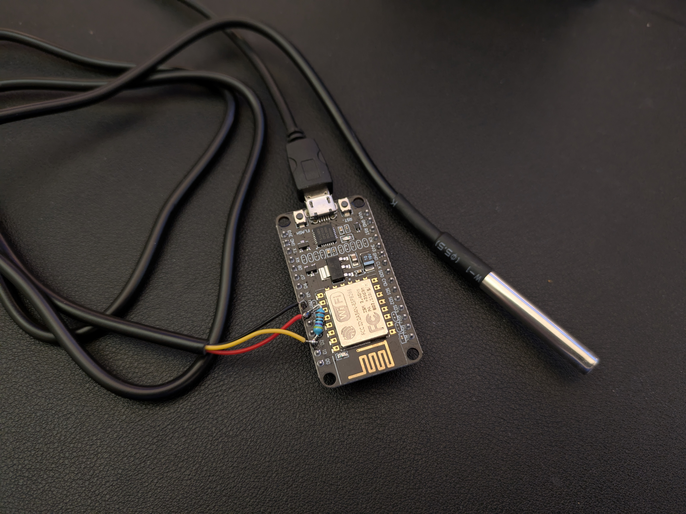
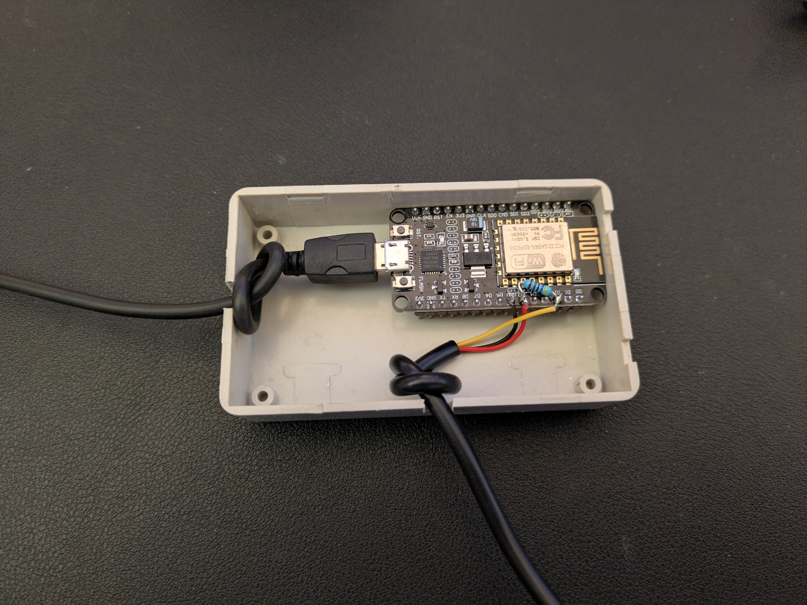

# IoT Weather Station

Wi-Fi weather station using [NodeMCU](https://en.wikipedia.org/wiki/NodeMCU) (a [ESP8266](https://en.wikipedia.org/wiki/ESP8266) development board) to read temperature and barometric pressure with a I2C [BMP280](https://www.amazon.com/s?k=bmp280) and send it to a HTTP endpoint using PHP to log data. This repository also contains code to use the simpler 1-Wire [DS18B20](https://www.analog.com/media/en/technical-documentation/data-sheets/ds18b20.pdf) thermometer.

## Live Data

View the realtime dashboard for thermometers running at my house:

* https://swharden.com/weather/

## Hardware

### Node MCU

* [Node MCU documentation](https://nodemcu.readthedocs.io/en/release/)
* [NodeMCU (Wikipedia)](https://en.wikipedia.org/wiki/NodeMCU)
* [ESP8266 datasheet (pdf)](https://www.espressif.com/sites/default/files/documentation/0a-esp8266ex_datasheet_en.pdf)

### BMP280 Temperature Sensor

* [BMP280 datasheet (PDF)](https://cdn-shop.adafruit.com/datasheets/BST-BMP280-DS001-11.pdf)

## Indoor Sensor

## Attic Sensor

## Outdoor Sensor (Version 1)

## Outdoor Sensor (Version 2)

_After a couple years moisture damaged the BMP280 module from the original design, so this unit was constructed. It is housed indoors and has a DS18B20 digital sensor on a short length of wire that was passed through an opening in the wall._

## Garage Sensor
_The garage sensor is the same design as the outdoor sensor but with a shorter power cord and the temperature probe sticks out the top of the enclosure. The blue "light" is just a hole drilled in the enclosure with a frosted clear panel glued to the underside. It captures and diffuses the light naturally emitted by the NodeMCU's onboard LEDs._

