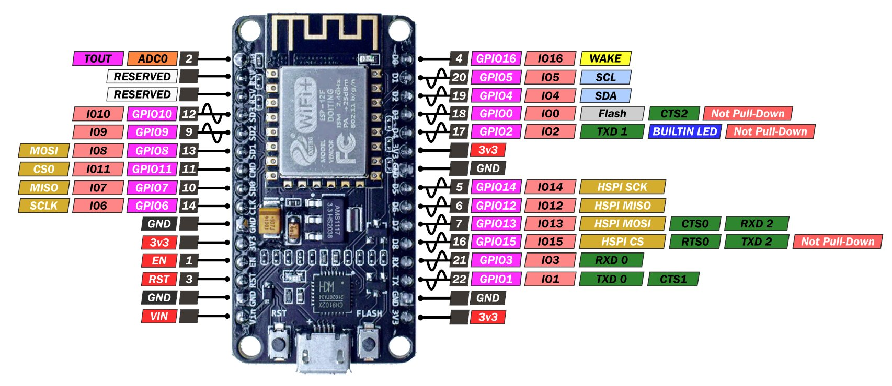
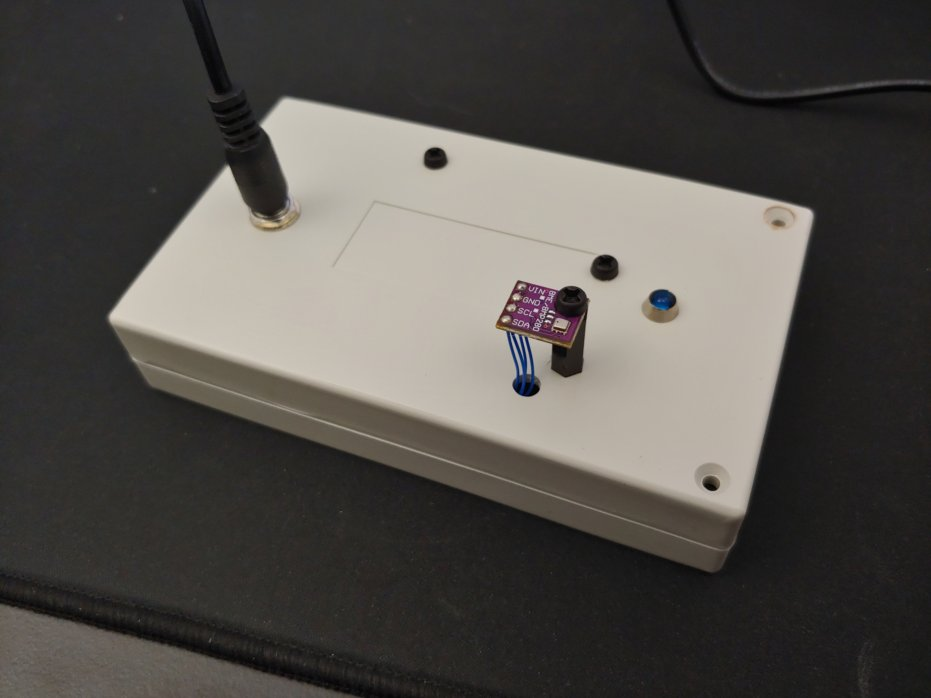
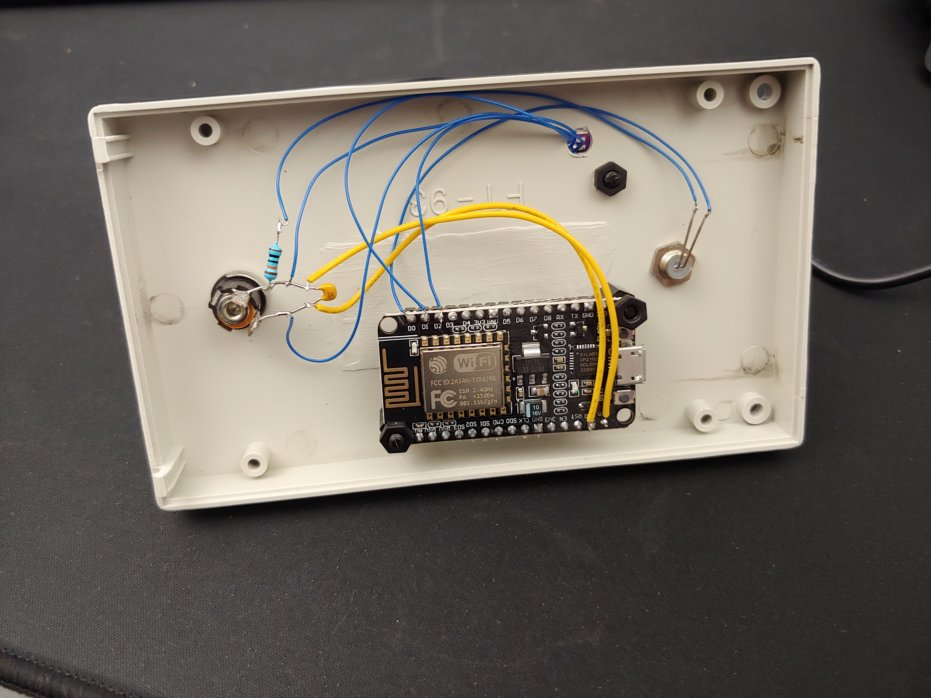

# IoT Weather Station

Wi-Fi weather station using [NodeMCU](https://en.wikipedia.org/wiki/NodeMCU) (a [ESP8266](https://en.wikipedia.org/wiki/ESP8266) development board) to read temperature and barometric pressure with a [BMP280](https://www.amazon.com/s?k=bmp280) and send it to a HTTP endpoint using PHP to log data.

## Live Data

View the realtime dashboard for thermometers running at my house:

* https://swharden.com/weather/

## Hardware

### Node MCU

* [Node MCU documentation](https://nodemcu.readthedocs.io/en/release/)
* [NodeMCU (Wikipedia)](https://en.wikipedia.org/wiki/NodeMCU)
* [ESP8266 datasheet (pdf)](https://www.espressif.com/sites/default/files/documentation/0a-esp8266ex_datasheet_en.pdf)

### BMP280 Temperature Sensor

* [BMP280 datasheet (PDF)](https://cdn-shop.adafruit.com/datasheets/BST-BMP280-DS001-11.pdf)

## Indoor Sensor

## Attic Sensor

## Outdoor Sensor

## Software
* Microcontroller code (Arduino): [`src/firmware/`](src/firmware/)
* HTTP backend (PHP): [`src/backend/`](src/backend/)
* HTTP frontend (React): [`src/frontend/`](src/frontend/)

## Resources
* [C# Data Visualization](https://swharden.com/csdv/)
* [ScottPlot.NET](https://scottplot.net)
* [AVR Projects](https://github.com/swharden/AVR-projects) (GitHub)

## Authors
* Backend: Scott W Harden https://SWHarden.com
* Frontend: Leah X Harden https://LeahXinli.com
